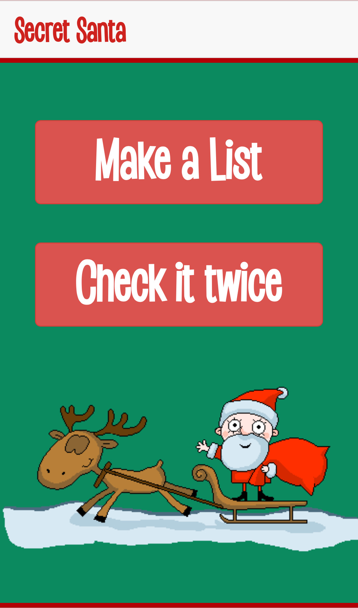
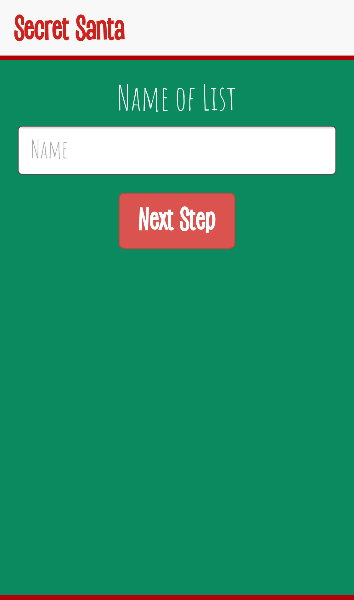
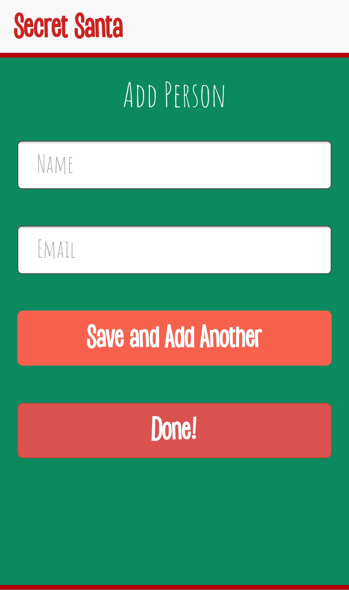
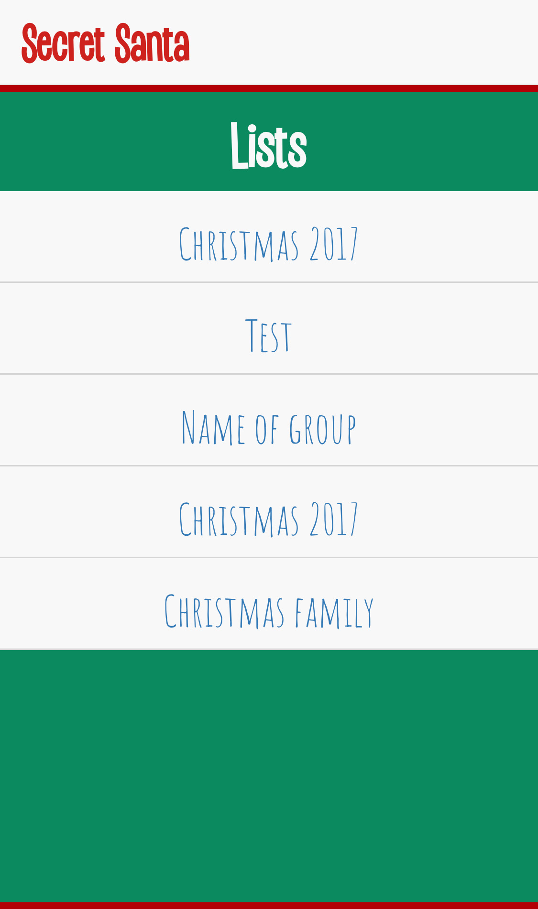
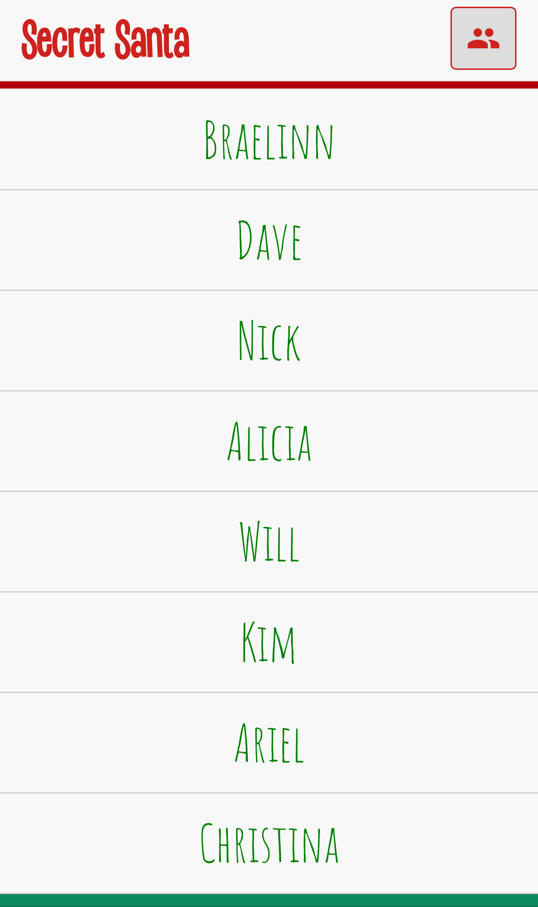
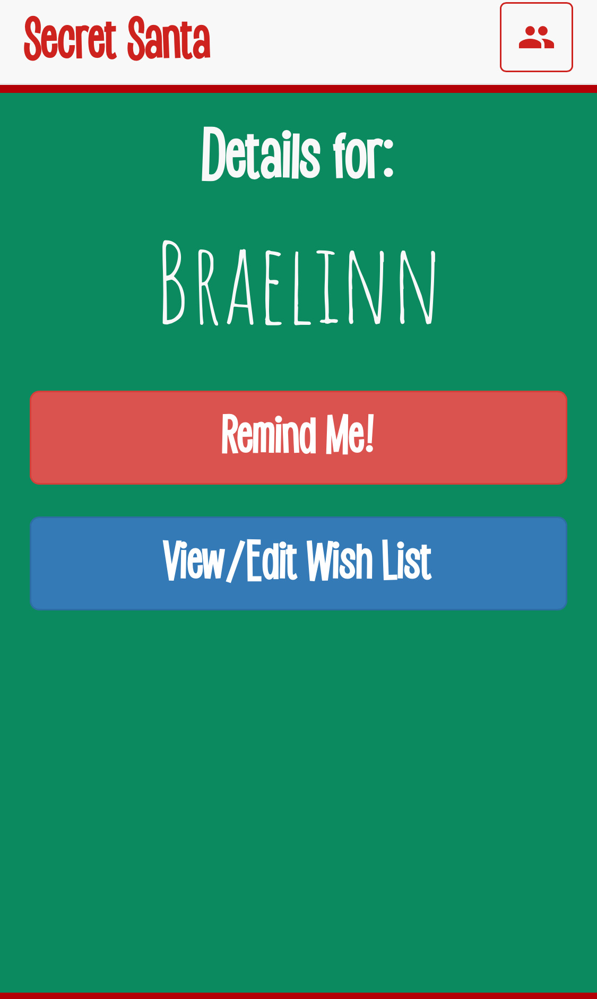

#Secret Santa

A project started during Christmas of 2017 to facilitate a Secret Santa drawing between family. 

_The problem being solved:_ When you do a Secret Santa with family, there are always people you are not going to want to draw because you will be buying them gifts regardless of whether you draw their name or not. This can be parents, romantic partners, mortal enemies, anyone!

_The Solution!:_ Using this Secret Santa app, you can create your list of people, add their email addresses, and select their "Exceptions". These are people that you want to take out of the drawing for particular users. For example, I would make my wife an exception since I plan on buying her gifts anyway because I don't like sleeping with the dog.

_Extra Features!:_ In addition to the drawing, this app also allows you to create a wish list of items you would like so that you can better inform you secret santa! The wish list also scrapes the website of whatever link you put in there in hopes of gathering metadata about the app and giving a preview to display on the list. Once a wish is added, you secret santa will receive an email informing them that the list has been updated so they can check it out!

As well as the wishlist, if you're like me and have a terrible memory, you can go to your name on the list and press the "Remind Me" button and you will receive an email with the name of who you drew in Secret Santa

_Future Development:_
* Log in so that you can only edit your own wishlist and not others
* The ability to manage multiple secret santa groups with one login

Some (outdated) screenshots \/ \/ \/

### Mobile Home

### Mobile Naming the List

### Mobile Adding to List

### Mobile Viewing the Lists

### Mobile User Drowdown List

### Mobile User Detail

